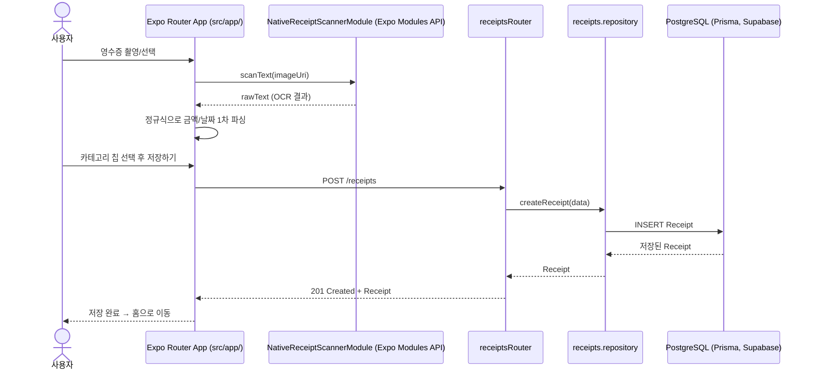

# 🧸 모으곰 (Mogom) — Expo

영수증을 촬영하면 온디바이스 OCR(Optical Character Recognition, 광학 문자 인식)로 가맹점명·금액·날짜를 자동으로 인식해 기록해주는 가계부 앱입니다.

> 이 저장소는 기존 React Native CLI(bare workflow) 프로젝트인 [ReceiptScannerApp](https://github.com/silverj0805/ReceiptScannerApp)을 **Expo / Expo Router 기반으로 이식(migrate)**하는 프로젝트입니다. 백엔드·디자인·비즈니스 로직(OCR 파싱 규칙, API 스펙 등)은 원본과 동일하게 유지하면서, 내비게이션·네이티브 모듈·빌드 방식만 Expo 생태계에 맞게 다시 구성했습니다. (자세한 배경은 아래 [CLI → Expo 마이그레이션](#cli--expo-마이그레이션) 참고)

## 주요 기능

- **영수증 촬영/선택 → 자동 인식**: 카메라로 찍거나 갤러리에서 고르면, 커스텀 네이티브 모듈이 사진 속 텍스트를 기기 안에서 바로 인식합니다. 사진 파일 자체는 서버로 전송되지 않습니다.
- **인식 결과 확인 및 수정**: 인식된 가맹점명/금액/날짜를 자동으로 채워주되, 저장 전에 직접 확인하고 카테고리를 선택해 수정할 수 있습니다.
- **직접 작성**: 촬영 없이 수기로도 지출을 기록할 수 있습니다.
- **월별 요약 및 필터링**: 이번 달 지출 요약, 카테고리·기간별 목록 조회를 지원합니다.
- **개인정보처리방침 / 이용약관**: 설정 화면 안에서 바로 확인할 수 있습니다.

## 영수증 등록 흐름



## 기술 스택

| 구분           | 사용 기술                                                                                             |
| -------------- | ----------------------------------------------------------------------------------------------------- |
| 코어           | Expo SDK 57, React Native 0.86 (New Architecture), React 19, TypeScript                               |
| 내비게이션     | Expo Router (파일 기반 라우팅, Stack + Bottom Tabs)                                                   |
| 상태/데이터    | TanStack Query, Zustand, React Hook Form                                                              |
| 스타일링       | Tailwind CSS + uniwind                                                                                |
| 카메라/이미지  | react-native-vision-camera (촬영 프리뷰), expo-image-picker (갤러리 선택)                             |
| 온디바이스 OCR | 커스텀 Expo Module (Android: ML Kit 한국어 인식기 / iOS: Vision 프레임워크)                           |
| 네트워킹       | Axios, 기기별 `X-Device-Id` 헤더 기반 무가입 인증                                                     |
| 모니터링       | Firebase Crashlytics (Expo config plugin)                                                             |
| 네이티브 빌드  | CNG(Continuous Native Generation) — `ios/`·`android/`는 커밋하지 않고 `expo prebuild`로 그때그때 생성 |
| 기타           | expo-dev-client, expo-splash-screen, react-native-webview, react-native-reanimated                    |
| 테스트         | Jest(jest-expo preset), React Native Testing Library, MSW                                             |

## 아키텍처

- **기능 단위(feature-based) 구조**: `scan`(촬영/인식), `confirm`(인식 결과 확인/수정·직접 기록), `receipt`(홈/목록/상세), `settings`로 화면·API·유틸을 도메인별로 분리했습니다.
- **라우팅과 구현의 분리**: `src/app/` 아래 파일은 실제 화면을 렌더링만 하는 얇은 re-export(`export { default } from '@/features/scan/screens/ScanScreen'`)이고, 화면 구현체와 테스트는 `src/features/<feature>/screens/`에 있습니다. Expo Router는 `app/` 아래 모든 파일을 라우트 후보로 스캔하고 [테스트 파일을 두지 말 것을 공식적으로 안내](https://docs.expo.dev/router/reference/testing/)하기 때문입니다.
- **온디바이스 OCR 커스텀 Expo Module**: `modules/native-receipt-scanner/`에 Android(Kotlin)는 ML Kit, iOS(Swift)는 Vision 프레임워크로 각각 구현하고, 하나의 JS 인터페이스(`NativeReceiptScannerModule.scanText(uri)`)로 호출합니다.
- **회원가입 없는 인증**: 로그인 절차 없이 기기 식별자(`X-Device-Id`)로 사용자를 구분하며, 모든 요청에 자동으로 실려 나갑니다.
- **에러 모니터링**: 렌더링 중 잡히지 않은 에러와 API 실패를 화면·API 컨텍스트와 함께 Firebase Crashlytics로 기록합니다.

```
src/
├── app/                    # 라우팅 전용 — 대부분 features/*/screens를 re-export하는 얇은 파일
│   ├── (tabs)/             # 하단 탭(홈/기록/스캔/내역/설정)
│   ├── confirm.tsx
│   ├── receipts/[id].tsx
│   └── settings/
├── features/
│   ├── scan/               # 카메라 촬영, 갤러리 선택
│   ├── confirm/            # OCR 결과 확인/수정, 직접 기록
│   ├── receipt/            # 홈, 목록, 상세, 월별 요약
│   └── settings/           # 설정, 라이선스, 약관 WebView
├── shared/                 # API 클라이언트, 공통 컴포넌트, Firebase, 전역 스토어
└── mocks/                  # MSW 기반 API 목(mock)

modules/
└── native-receipt-scanner/ # 커스텀 Expo Module (Android Kotlin / iOS Swift)
```

법적 고지(개인정보처리방침·이용약관) 페이지는 새로 만들지 않고, 원본 CLI 저장소의 GitHub Pages를 그대로 가리킵니다 — 내용은 하나만 관리하면 됩니다.

## CLI → Expo 마이그레이션

원본은 React Native CLI(bare workflow)로 만든 [ReceiptScannerApp](https://github.com/silverj0805/ReceiptScannerApp)이고, 이 저장소는 그 기능을 그대로 옮기면서 Expo/Expo Router/EAS 관련 실무 경험을 쌓기 위해 시작한 프로젝트입니다. 백엔드는 두 저장소가 공유하고, 화면 디자인·비즈니스 로직(OCR 파싱 정규식, 필터링 로직 등)도 동일하게 유지합니다. 달라진 지점은 크게 네 가지입니다.

| 영역          | CLI (원본)                                 | Expo (이 저장소)                               |
| ------------- | ------------------------------------------ | ---------------------------------------------- |
| 내비게이션    | React Navigation                           | Expo Router (파일 기반 라우팅)                 |
| 네이티브 모듈 | 커스텀 TurboModule (`specs/`)              | 커스텀 Expo Module (`modules/`)                |
| 갤러리 선택   | react-native-image-picker                  | expo-image-picker (이미 설치돼 있던 걸 재사용) |
| 네이티브 빌드 | bare 프로젝트(직접 `ios/`·`android/` 관리) | CNG — `expo prebuild`로 필요할 때만 생성       |

### 커밋 단위가 큰 이유

이 저장소의 커밋은 파일이나 함수 단위가 아니라 **기능(feature) 단위 수직 이식**으로 나뉩니다(`feat: features/scan 이식`, `feat: features/receipt 이식`처럼). 화면 하나를 이식할 때 보통 다음이 한 커밋에 같이 들어갑니다.

- 그 기능에 속한 화면·컴포넌트·훅·타입 여러 파일
- 필요한 새 패키지 설치(+ 필요하면 native rebuild까지)
- TDD로 먼저 작성한 테스트 전체
- `app/` 아래 라우팅 연결(thin re-export)

같은 기능 안의 파일들은 서로 강하게 의존해서(화면 하나에서만 쓰는 하위 컴포넌트, 공유 타입 등), 더 잘게 쪼개면 오히려 "중간에 깨진 상태"의 커밋만 늘어난다고 판단했습니다. 그래서 이 저장소는 커밋 하나가 곧 이식이 끝난 기능 하나가 되도록, **기능 단위 = 커밋 단위**를 기본 원칙으로 삼았습니다.

## AI 에이전트 활용

이 프로젝트는 AI 에이전트와 협업하여 만들었습니다. AI 에이전트의 활용 범위와 영향력이 점점 커지는 요즘, 에이전트를 잘 다루고 조율하는 능력을 기르는 것도 이 프로젝트의 목적 중 하나였습니다.

이 프로젝트를 통해 에이전트와 협업하며 연습한 것:

> AI 에이전트를 결과물을 받는 단순 도구가 아니라 검증이 필요한 협업 파트너다.

1. 작업을 통째로 맡기지 않고 기능 단위마다 정지점을 둬서, 진행 속도 자체를 명시적으로 조율하며 각 단계를 직접 검수 및 리뷰합니다.
2. 빠르게 버전이 바뀌는 라이브러리(특히 Expo SDK/Expo Router)를 다룰 때는 에이전트의 기억이 아니라 실제 설치된 버전의 공식 문서·소스(`node_modules`)를 먼저 확인하도록 지침을 미리 박아둬 오래된 버전으로 인한 오류를 사전에 방지합니다.
3. 구현은 TDD로 진행해 테스트가 명세를 먼저 규정하게 함으로써 프로덕트의 안정성을 한 단계 더 끌어올립니다.
4. 불확실성이 큰 이슈에 대해서는 에이전트가 스스로 가설을 세우고 실제 측정(시뮬레이터 실행, 네이티브 재빌드 등)으로 검증 및 반증하며, 통하지 않으면 그걸 숨기지 않고 실패로 인정하도록 요구합니다.
5. 어떤 방식을 추천할 때도 근거 없이 받아들이지 않고 반드시 명확한 근거와 트레이드오프를 함께 제시하게 해, 최종 판단은 항상 제가 내리는 구조를 유지합니다.
6. 커밋·푸시처럼 되돌리기 번거로운 작업은 에이전트가 스스로 실행하지 않고, 항상 메시지만 추천한 뒤 최종 실행은 제가 직접 합니다.

이런 습관들이 쌓이면서 AI 에이전트는 빠르게 답만 내놓는 도구가 아니라, 가설을 세우고 실험하며 스스로를 검증하는 신뢰할 수 있는 협업 파트너가 됐습니다.
