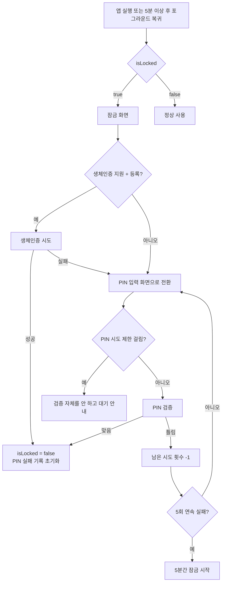
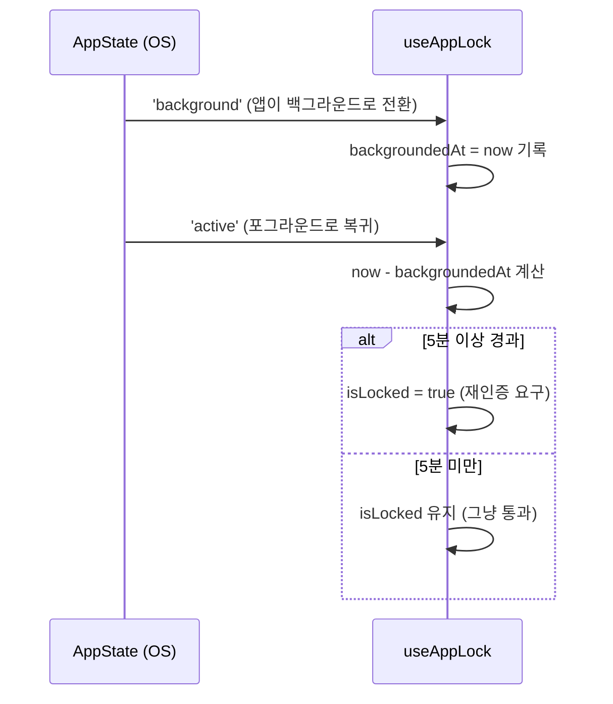
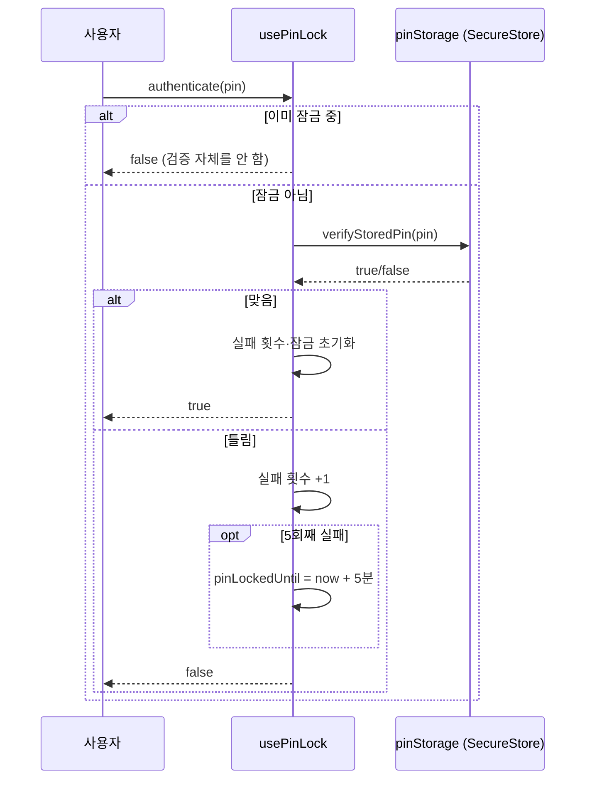

# 앱 잠금 (appLock)

생체인증(Face ID/지문) 우선, 실패·미지원 시 PIN으로 대체하는 앱 잠금 기능. 보안 정책과 실제 동작 흐름을 정리한다.

## 보안 정책

1. **생체인증 게이트**: 앱 최초 진입 시, 그리고 세션 정책에 따라 재인증이 필요할 때 Face ID/지문 인증을 요구한다.
2. **세션(비활성 타임아웃) 정책**: 앱이 백그라운드로 전환된 시각을 기록해두고, 포그라운드로 복귀했을 때 그 시각으로부터 **5분 이상 경과했으면 재인증을 다시 트리거**한다. 5분 미만이면 그냥 통과시킨다(매번 무조건 잠그지 않음).
3. **생체인증 대체 수단(PIN)**: 생체인증이 미지원·미등록이거나 실패했을 때 PIN으로 대체 인증할 수 있게 한다.
4. **보안 저장소(`expo-secure-store`) 사용 대상은 PIN(솔트+반복 해시)뿐이다.** "유출되면 실제로 뚫리는 값"만 SecureStore에 넣는다는 원칙.
5. **PIN은 원문이 아니라 솔트(기기별 랜덤값) + 반복 해시로 저장한다.** `expo-crypto`는 SHA-256 같은 단발 해시만 제공하고 PBKDF2/bcrypt 같은 반복 전용 KDF는 없어서, `SHA256(salt + PIN)`을 1만 번 직접 반복하는 차선책을 쓴다. 4~6자리 PIN은 경우의 수가 최대 100만 개뿐이라 이 반복 해시만으로 브루트포스를 막을 순 없다 — 그래서 방어는 아래처럼 3중 구조다.

### PIN 인증 3중 방어 구조

| 순서 | 방어                                   | 역할                                                          |
| ---- | -------------------------------------- | ------------------------------------------------------------- |
| 1차  | PIN 시도 횟수 제한(`usePinLock`)       | 온라인 대입 공격 자체를 차단                                  |
| 2차  | `expo-secure-store`(Keychain/Keystore) | OS 레벨 암호화 — 기기 탈취 방어                               |
| 3차  | 솔트 + 반복 해시(`pinHash`)            | Keychain/Keystore가 뚫렸을 때의 오프라인 브루트포스 비용 증가 |

## 아키텍처

```
src/features/appLock/
├── biometric/
│   └── hooks/useBiometricAuth.ts   # 하드웨어 감지(isSupported/isEnrolled) + authenticate()
├── pin/
│   ├── utils/
│   │   ├── pinHash.ts              # 솔트 생성 + SHA-256 반복 해시 + 검증
│   │   └── pinStorage.ts           # PIN(salt+해시)을 SecureStore에 저장/조회/삭제
│   └── hooks/usePinLock.ts         # PIN 검증 + 시도 횟수 제한(rate limiting)
└── hooks/useAppLock.ts             # isLocked + 세션(5분) 타임아웃 + 위 두 훅을 조합
```

- **`useBiometricAuth`**: `expo-local-authentication`만 의존. 하드웨어 지원·등록 여부와 `authenticate()`(성공/실패만 반환)를 제공. 잠금 상태는 모른다.
- **`usePinLock`**: `pinStorage`만 의존. PIN 검증, PIN 5회 실패 시 5분 잠금, 남은 시도 횟수·잠금 해제까지 남은 시간을 제공. 잠금 상태는 모른다.
- **`useAppLock`**: 위 두 훅을 조합하는 오케스트레이터. "지금 잠겨 있는지"와 "언제 다시 잠글지(백그라운드 5분)"만 책임지고, 실제 인증 로직은 전혀 모른다.

## 동작 흐름

### 1) 앱 진입 / 잠금 해제 흐름



### 2) 세션 타임아웃 (백그라운드 5분)



### 3) PIN 시도 횟수 제한 (rate limiting)


