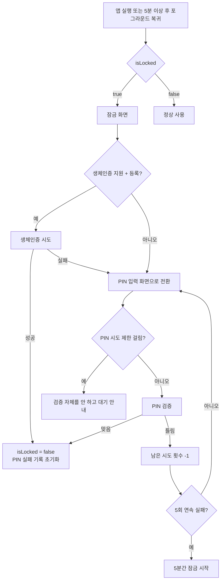
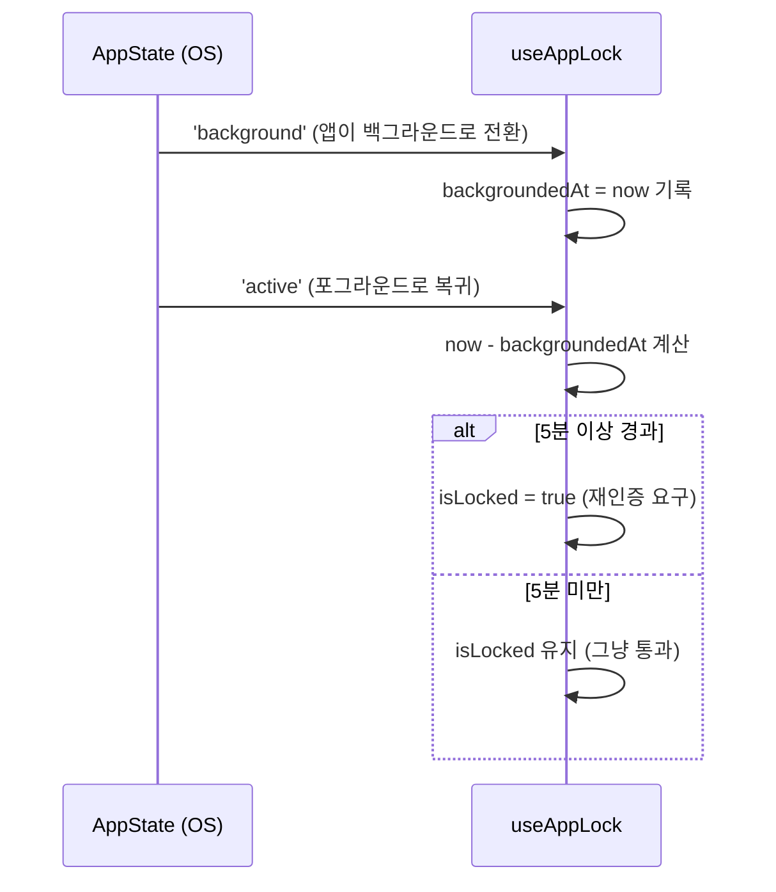
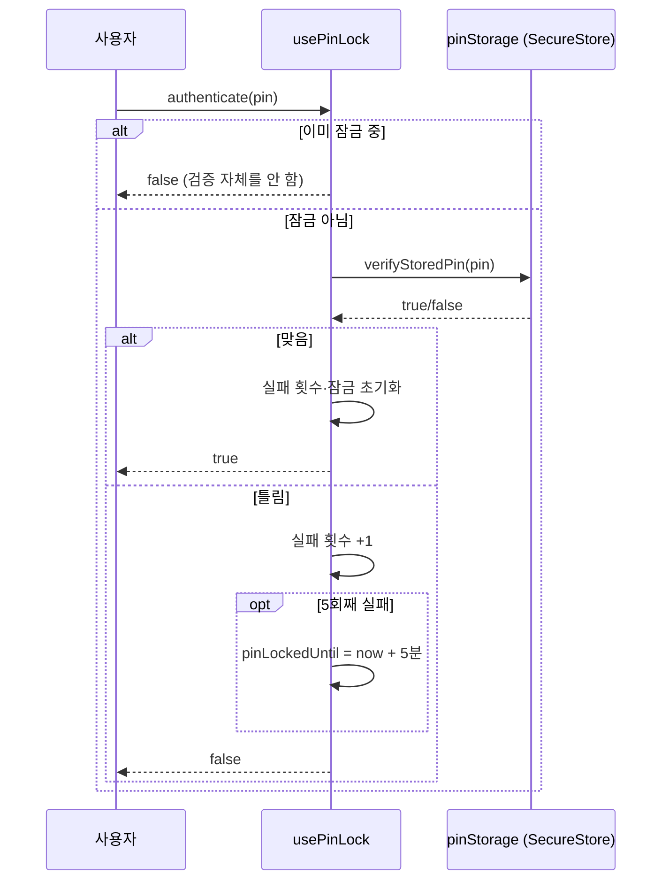

# 앱 잠금 (appLock)

생체인증(Face ID/지문) 우선, 실패·미지원 시 PIN으로 대체하는 앱 잠금 기능. 보안 정책과 실제 동작 흐름을 정리한다.

## 보안 정책

1. **생체인증 게이트**: 앱 최초 진입 시, 그리고 세션 정책에 따라 재인증이 필요할 때 Face ID/지문 인증을 요구한다.
2. **세션(비활성 타임아웃) 정책**: 앱이 백그라운드로 전환된 시각을 기록해두고, 포그라운드로 복귀했을 때 그 시각으로부터 **5분 이상 경과했으면 재인증을 다시 트리거**한다. 5분 미만이면 그냥 통과시킨다(매번 무조건 잠그지 않음).
3. **생체인증 대체 수단(PIN)**: 생체인증이 미지원·미등록이거나 실패했을 때 PIN으로 대체 인증할 수 있게 한다.
4. **보안 저장소(`expo-secure-store`) 사용 대상은 PIN(솔트+반복 해시)뿐이다.** "유출되면 실제로 뚫리는 값"만 SecureStore에 넣는다는 원칙.
5. **PIN은 원문이 아니라 솔트(기기별 랜덤값) + 반복 해시로 저장한다.** `expo-crypto`는 SHA-256 같은 단발 해시만 제공하고 PBKDF2/bcrypt 같은 반복 전용 KDF는 없어서, `SHA256(salt + PIN)`을 1만 번 직접 반복하는 차선책을 쓴다. 4~6자리 PIN은 경우의 수가 최대 100만 개뿐이라 이 반복 해시만으로 브루트포스를 막을 순 없다 — 그래서 방어는 아래처럼 3중 구조다.

### PIN 인증 3중 방어 구조

| 순서 | 방어                                   | 역할                                                          |
| ---- | -------------------------------------- | ------------------------------------------------------------- |
| 1차  | PIN 시도 횟수 제한(`usePinLock`)       | 온라인 대입 공격 자체를 차단                                  |
| 2차  | `expo-secure-store`(Keychain/Keystore) | OS 레벨 암호화 — 기기 탈취 방어                               |
| 3차  | 솔트 + 반복 해시(`pinHash`)            | Keychain/Keystore가 뚫렸을 때의 오프라인 브루트포스 비용 증가 |

## 아키텍처

```
src/features/appLock/
├── biometric/
│   └── hooks/useBiometricAuth.ts   # 하드웨어 감지(isSupported/isEnrolled) + authenticate()
├── pin/
│   ├── utils/
│   │   ├── pinHash.ts              # 솔트 생성 + SHA-256 반복 해시 + 검증
│   │   └── pinStorage.ts           # PIN(salt+해시)을 SecureStore에 저장/조회/삭제
│   └── hooks/usePinLock.ts         # PIN 검증 + 시도 횟수 제한(rate limiting)
└── hooks/useAppLock.ts             # isLocked + 세션(5분) 타임아웃 + 위 두 훅을 조합
```

- **`useBiometricAuth`**: `expo-local-authentication`만 의존. 하드웨어 지원·등록 여부와 `authenticate()`(`{ success, isLockedOut }` 반환 — `isLockedOut`은 OS가 5회 연속 실패 등으로 생체인증을 이미 잠근 상태인지)를 제공. 잠금 상태는 모른다.
- **`usePinLock`**: `pinStorage`만 의존. PIN 검증, PIN 5회 실패 시 5분 잠금, 남은 시도 횟수·잠금 해제까지 남은 시간을 제공. 잠금 상태는 모른다.
- **`useAppLock`**: 위 두 훅을 조합하는 오케스트레이터. "지금 잠겨 있는지"와 "언제 다시 잠글지(백그라운드 5분)"만 책임지고, 실제 인증 로직은 전혀 모른다.

## 동작 흐름

### 1) 앱 진입 / 잠금 해제 흐름



### 2) 세션 타임아웃 (백그라운드 5분)



### 3) PIN 시도 횟수 제한 (rate limiting)



### 4) 케이스별 시나리오 (end-to-end)

사용자가 정리한 케이스 목록을 실기기(시뮬레이터) 재현으로 검증하면서 바로잡거나 채운 것.
원래 목록에 없던 항목엔 **[추가]**, 실제 동작과 달라서 고친 항목엔 **[정정]** 표시.

**0. 스플래시 노출 중 인증 설정 정보 로딩**
`expo-splash-screen`을 config plugin으로만 붙였고 `preventAutoHideAsync`/`hideAsync`를 코드에서
직접 안 쓰므로, 네이티브 스플래시는 JS 루트 뷰의 첫 레이아웃 시점에 자동으로 내려간다 — `hasPinSet()`
조회(`useSecuritySetupStatus`)가 끝나기 **전에** 스플래시가 먼저 사라질 수 있다는 뜻. 그 사이엔
`AppLockGate`의 `isLoading` 분기(빈 `bg-background` 화면)가 아주 잠깐 보일 수 있다. 실기기에서
눈에 띄는 플래시로 느껴지는지는 아직 확인 못 했다.

**1. 무잠금 상태 (생체인증 선택 여부 null && PIN 정보도 없을 때)**

1. 홈 > `HomeSecurityOnboarding` 모달이 뜬다
   1. "네, 설정할게요" 클릭 **[정정: "설정화면으로 이동"이 아니라, 모달만 닫히고 같은 홈 화면 위에
      `SecuritySetupSheet`(바텀시트)가 뜬다 — 화면 전환이 없다]**
      1. 보안 잠금 설정하기
         1. 생체인증이 지원된다면
            1. 생체인증 선택 → `biometricEnabled: true`로 셋팅되고
            2. PIN 설정 플로우: `PinRegisterForm` 1차 입력 → 2차 재확인 → 설정 완료
               1. 이때 PIN 등록 폼 상단에 생체인증 관련 안내 문구(`Face ID를 선택하셨어도...`)가
                  1차·2차 입력 화면 모두에 보인다
         2. 생체인증이 지원 안 된다면
            1. 바로 PIN 설정 플로우
      2. PIN 등록까지 완료하면 `SecuritySetupSheet`가 닫히고 `useSecuritySetupStatus().refetch()`로
         "설정 완료" 상태를 다시 조회한다 **[정정 — 실기기 버그 발견·수정: `refetch()`를 안 부르면
         `HomeSecurityOnboarding`의 `isSecuritySetUp`이 stale하게 false로 남아서, 시트가 닫히자마자
         온보딩 모달이 곧바로 다시 뜬다. 생체인증을 선택한 경우는 `biometricEnabled`가 전역
         반응형 상태라 우연히 안 걸렸고, PIN 전용 등록 때만 재현됐다.]**
      3. 아무것도 안 하고 닫기(X) 버튼만 누르면 → 잠금 거절 일자가 여전히 null이므로 시트가
         닫히자마자(홈 화면으로 "이동"할 필요도 없이, 같은 화면이라) 온보딩 모달이 바로 다시 뜬다
   2. "다음에 할게요" 클릭 → 모달이 닫히고, 하루에 한 번만 뜨도록 거절 시각을
      `onboardingDeclinedAt`에 zustand persist로 저장(24시간 지나면 다시 노출)

**2. 인증 정보 셋팅된 상태에서 앱 포그라운드 상태**

1. PinLockedOut 비활성화된 상태일 때
   1. 설정 > 보안 잠금 방법 변경하기
      1. 생체인증이 지원됨
         1. "변경하기" 클릭 → `SecuritySetupSheet` 모달이 뜸(이때 현재 방법이 `currentMethod`로
            같이 넘어간다)
            1. **기존에 선택돼 있던 방법은 클릭해도 아무 반응 없음** — 행 자체가 비활성화되고
               "현재 사용 중인 방법이에요" 문구 + 체크 아이콘으로 바뀐다
            2. 선택 안 돼 있던 새로운 방법을 선택하면, PIN 재등록 플로우(등록 폼)로 들어가고
               완료하면 보안 잠금 방법 정보가 업데이트되며 모달이 닫힘
      2. 생체인증이 지원 안 됨
         1. "변경하기" 버튼 화면에서 보이지 않음
   2. 설정 > 인증 초기화
      1. 모든 인증 정보가 초기화되고 무잠금 상태와 동일한 상태로 돌아감
   3. 백그라운드 5분 초과 후 다시 활성화 상태로 돌아왔을 때
      1. 현재 보안 잠금 방법에 따라서, 생체 혹은 핀 "5분 이상 자리를 비우셨네요" 모달
         1. 인증 해제돼야 모달이 내려감
         2. 생체 인증 모달일 경우 OS가 정한 연속 실패 횟수(기기별 상이, 통상 5회)를 넘기면
            핀 번호 입력으로 넘어감
         3. 핀 번호 입력 모달에서 남은 시도 횟수(5회)를 넘겼을 때 PinLockedOut 활성화
            **[추가: 2.1의 "생체 선택" 경로로 들어와서 핀으로 전환된 경우도 동일하게 적용된다 —
            생체·PIN 둘 다 같은 `usePinLock` 인스턴스를 공유하므로, 생체 실패 후 전환된 PIN도
            5회 틀리면 똑같이 PinLockedOut이 걸린다. 원래 목록엔 이 nested case가 2.2(생체
            미선택)에만 적혀 있었다.]**
2. PinLockedOut 활성화된 상태일 때
   1. 카운트다운 동안 이 모달만 뜸(키패드 비활성화). 시간이 다시 지나야 핀 번호 입력 활성화
   2. 활성화된 핀 번호를 통과해야 PinLockedOut 비활성화 가능
   3. **[추가] 카운트다운이 자연 만료돼 입력이 다시 활성화돼도, 남은 시도 횟수는 자동으로
      5회로 복구되지 않는다** — `usePinLock`은 성공 인증 때만 실패 횟수를 리셋한다. 즉 만료
      직후 한 번 더 틀리면 바로 재잠금된다(의도된 정책인지 확인 필요).

**3. 인증 정보 셋팅된 상태에서 앱을 처음 진입할 때**

1. 인증 정보가 통과될 때까지 `AppStack`(보호된 화면) 자체가 마운트되지 않으므로, 그 안의
   API 호출은 "pending"이 아니라 **아예 시작되지 않는다**(더 강한 보장) **[정정]**
2. 생체 정보 선택 여부
   1. 선택
      1. 생체인증 모달이 뜸
      2. OS가 정한 연속 실패 횟수를 넘기면 핀 번호 입력이 뜸
      3. 그 뒤 핀 번호도 5회 넘기면 PinLockedOut 활성화 플로우로 이어짐 **[추가 — 2.1.3.1과
         동일한 이유로 원래 목록에 없던 nested case]**
      4. 넘기기 전에 통과하면 API 호출이 시작되고 모달도 닫힘
   2. 미선택
      1. 핀 번호 입력창이 뜸
         1. 남은 시도 횟수를 초과하면 PinLockedOut 활성화 플로우를 탐
         2. 남은 시도 횟수 전에 통과하면 API 호출이 시작되고 모달도 닫힘
