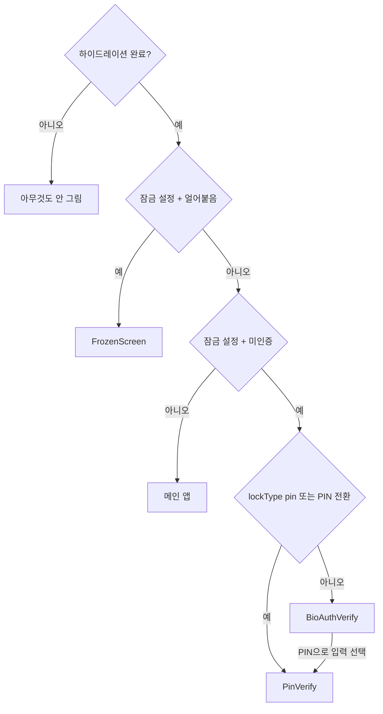

# 앱 잠금(App Lock) 보안 정책

이 문서는 `appLock/` 기능이 실제로 채택하고 있는 **보안 정책**을 설명합니다.
보안 정책 기능의 "무엇을 어떤 기준으로 지킬지"에 대한 결정과 그 근거를 정리한 문서입니다.

## 1. 목적과 범위

- **목적**: 기기를 잠깐 손에서 놓거나 잃어버렸을 때, 앱을 곧바로 열어 지출 내역(금액·가맹점·카테고리)을 들여다볼 수 없게 막는 **기기 단(on-device) 프레젠테이션 레이어 잠금**입니다.
- **범위 밖**: 이 잠금은 서버 쪽 인증이 **아닙니다**. 백엔드는 `X-Device-Id` 헤더로 기기를 구분할 뿐 진짜 인증이 아니며(헤더는 조작 가능), 이 문서의 정책은 그 부분을 다루지 않습니다. 이 앱은 로그인이 없고 기기 식별자만으로 서버의 영수증 데이터(가맹점·금액·날짜 등)를 그대로 불러오므로, **앱 잠금을 우회하면 그 기기에 연결된 서버 데이터가 앱 화면을 통해 그대로 보입니다** — 이게 바로 이 잠금이 막으려는 목적(§1 위)입니다. 다만 이건 어디까지나 "이 기기를 손에 쥔 사람이 이 화면을 통해 보는 것"일 뿐, 앱 잠금 우회 자체가 서버 인프라(DB/API)를 직접 뚫거나 다른 기기·다른 사용자의 데이터까지 노출시키는 건 아닙니다. 반대로 앱 잠금을 통과했다고 해서 서버가 그 기기를 "인증된 사용자"로 강하게 보증하는 것도 아닙니다(위 `X-Device-Id` 한계). 앱 잠금과 서버 쪽 보증은 완전히 분리된 레이어입니다.
- **대상 사용자**: 로그인/회원가입이 없는 앱이라 "기기를 물리적으로 만질 수 있는 사람"이 유일한 위협 행위자입니다. 아래 위협 모델은 이 전제를 기준으로 씁니다.

## 2. 위협 모델

| 시나리오                                                                            | 이 잠금이 막는가? |
| ----------------------------------------------------------------------------------- | :---------------: |
| 잠금 해제된 폰을 주워 든 사람이 홈 화면에서 앱을 눌러본다                           |        ✅         |
| 가족·동료가 옆에서 화면을 넘겨보다 앱 스위처(최근 앱 목록)에서 지출 내역을 훔쳐본다 |      ✅ (§8)      |
| 공격자가 PIN을 무작위로 계속 시도해 맞힌다                                          | ✅ (§6, 5회 제한) |
| 공격자가 기기를 탈옥/루팅해서 앱 저장소 파일을 직접 읽는다                          |  ❌ (§12에 명시)  |
| 공격자가 백업 추출 도구로 Keychain/Keystore 내용을 통째로 빼낸다                    |  ❌ (§12에 명시)  |
| 서버 API를 직접 두드려 다른 기기의 데이터를 요청한다                                | ❌ (범위 밖, §1)  |

**정책**: "탈옥/루팅된 기기의 포렌식 공격"이나 "서버 사이드 공격"까지 막는 걸 목표로 하지 않습니다. 목표는 어디까지나 **평범한 사용자가 잠금 해제된 상태의 화면을 우연히 또는 캐주얼하게 들여다보는 걸 막는 것**입니다. 이 경계를 넘는 방어(§12)는 의도적으로 지금 범위에서 제외하였습니다.

## 3. 인증 수단

- 사용자는 **생체인증(Face ID/지문)** 또는 **PIN(6자리 숫자)** 중 하나를 잠금 방식으로 고릅니다.
- 생체인증을 지원하지 않거나(하드웨어 없음) 등록돼 있지 않은 기기(미지원)에는 PIN만 선택지로 보여줍니다.
- **정책 — PIN은 항상 함께 등록된다**: 생체인증을 선택했더라도 PIN은 예외 없이 함께 등록해야 합니다. 생체인증은 인식 실패(마스크, 젖은 손, 카메라 이물질 등)가 드물지 않게 발생하는 방식이라, 대체 수단 없이 생체인증 하나에만 의존하게 두지 않습니다.
- **정책 — 처음 잠금을 켤 때, 생체인증 미지원 기기는 자동으로 PIN 전용이 된다**: 방식을 아직 안 골랐던 사용자(`lockType`이 null)가 잠금을 처음 켜면, 그 시점에 생체인증을 못 쓰는 기기는 `lockType`이 바로 `'pin'`으로 저장됩니다. 이후로는 항상 PIN 검증 화면으로만 잠기고, 생체인증 화면 자체를 거치지 않습니다 — 처음부터 생체인증이 안 되는 기기의 실질적인 방어선은 이 경로입니다.
- **정책 — 생체인증 실패 시 PIN으로 전환 가능**: `lockType`이 `'bio'`인 상태에서 생체인증 화면에 진입했는데 계속 실패하면 "PIN으로 입력" 버튼으로 전환할 수 있습니다. 단 등록된 PIN이 실제로 있을 때만 이 버튼을 보여줍니다.

## 4. PIN 정책

- 길이는 **6자리 숫자**로 고정합니다. 4자리보다 무작위 대입 공간이 넓지만(10⁴ → 10⁶), §6의 시도 횟수 제한이 실질적인 방어선이라는 점은 동일합니다.
- 저장 위치는 **OS 보안 저장소**(**iOS Keychain** / **Android Keystore**, `expo-secure-store`)입니다. 잠금 설정 여부·방식 같은 비민감 값(§9)과 분리해서 별도 키로 관리합니다.
- **현재 평문으로 저장합니다.** 해싱(salt + 저속 KDF)은 의도적으로 나중으로 미룬 상태이며, 왜 미뤘는지와 언제 다시 다룰지는 §12에 남겨둡니다. 저장 위치(SecureStore)만 먼저 올바르게 잡아두고, 값의 형태(평문→해시)는 나중에 `pin/utils/index.ts` 내부 구현만 바꾸면 되도록 함수 시그니처(`savePin`/`verifyStoredPin`)를 설계해뒀습니다.

## 5. 생체인증 정책

- `expo-local-authentication`을 사용하며, **`disableDeviceFallback`은 켜지 않습니다**(기본값 false 유지).
- 생체인증을 여러 번 틀리면 OS가 자체 기기 패스코드 화면을 자동으로 띄워서 가로채는데, 이 동작을 앱이 막지 않고 그대로 둡니다 — OS가 이미 자기 방식대로 시도 제한/잠금을 처리해주므로, 앱이 별도로 재구현하지 않습니다.
- 생체인증 자체의 실패 횟수는 앱이 세지 않습니다(§6은 PIN에만 적용). OS가 `lockout` 에러를 주더라도 앱은 그걸 일반 실패 메시지로만 보여주고 별도로 얼리지(freeze) 않습니다 — 위 이유로 이미 OS가 그 상황을 처리하고 있기 때문입니다.

## 6. 실패 처리 및 잠금(Lockout) 정책

- PIN을 **연속 5회** 틀리면 일정 시간 동안 재시도 자체를 막습니다(얼림/freeze).
- 얼어있는 동안은 남은 시간을 카운트다운으로 보여주고, 시간이 다 돼도 사용자가 직접 "다시 시도하기"를 눌러야만 풀립니다(자동으로 안 풀림 — 사용자가 화면을 반드시 보게 하려는 의도).
- 얼어붙는 지속 시간은 **프로덕션 3분**입니다(개발 빌드는 반복 테스트를 위해 30초로 단축).
- **정책 — 실패 횟수와 잠금 상태는 반드시 영속화한다**: PIN 실패 횟수(`pinFailCount`)와 얼어붙은 만료 시각(`frozenUntil`)은 AsyncStorage에 저장해서, **앱을 강제 종료했다가 재실행해도 초기화되지 않습니다**. 컴포넌트 로컬 상태로만 두면 프로세스를 죽였다 켜는 것만으로 시도 횟수 제한이 무력화되기 때문입니다.
- PIN을 맞히면 실패 횟수는 그 자리에서 0으로 초기화됩니다. 얼어붙은 상태가 풀릴 때(쿨다운 완료 후 사용자가 직접 재시도)도 실패 횟수를 같이 0으로 되돌립니다.
- SecureStore 접근 자체가 실패하는(키체인 접근 오류 등) 경우는 "틀린 PIN"과 구분합니다 — 사용자 잘못이 아닌 시스템 오류로 실패 횟수를 깎으면, 무관한 오류 때문에 잠길 위험이 생기기 때문입니다.

## 7. 세션 정책

- 인증 상태(`authenticated`)는 **세션 로컬 값이며 절대 영속화하지 않습니다.** 앱을 재시작하면(콜드 스타트) 잠금이 설정돼 있는 한 항상 다시 인증해야 합니다.
- **백그라운드 5분 이상** 후 복귀하면 재인증을 요구합니다(세션 타임아웃). 이때는 "자리를 비우셨네요"라는 별도 문구로, 콜드 스타트로 인한 평범한 잠금과 구분해서 보여줍니다.
- 짧게 여러 번 백그라운드를 들락거린 시간은 합산하지 않습니다 — 매번 복귀 시점에 조건을 재확인하고 타이머를 초기화합니다.
- 설정 화면에서 방금 잠금을 켠 사람은 그 세션을 즉시 인증된 것으로 표시합니다

## 8. 화면 프라이버시 정책 (앱 전환기/캡처)

앱 잠금 설정 여부와 **무관하게 항상 적용**되는 정책입니다(잠금을 안 켜둔 사용자도 보호 대상):

- **iOS**: 앱이 백그라운드로 전환되는 순간(OS가 최근 앱 목록용 스냅샷을 찍는 바로 그 타이밍) 화면 위에 커버를 덮어 지출 내역이 그대로 캡처되지 않게 합니다.
- **Android 13(API 33) 이상**: `Activity.setRecentsScreenshotEnabled(false)`로 최근 앱 전환기 썸네일만 끕니다. `FLAG_SECURE`와 달리 스크린샷/화면 녹화 자체는 막지 않습니다 — 이건 의도적으로 완화한 범위입니다(썸네일 노출만 막고, 사용자가 명시적으로 스크린샷을 찍는 행위까지 막을 이유는 없다고 판단).

## 9. 데이터 저장 정책

| 값                                       | 저장 위치                      | 영속화 | 이유                                                             |
| ---------------------------------------- | ------------------------------ | :----: | ---------------------------------------------------------------- |
| PIN 값                                   | SecureStore(Keychain/Keystore) |   ✅   | 민감값 — OS 보안 저장소에만 둔다(§4)                             |
| `isLockSetUp`(잠금 켜짐 여부)            | AsyncStorage                   |   ✅   | 비민감 설정값이지만, PIN이 실제로 저장된 뒤에만 true가 된다(§10) |
| `lockType`(bio/pin 중 선택된 방식)       | AsyncStorage                   |   ✅   | 비민감값                                                         |
| `frozenUntil`, `pinFailCount`            | AsyncStorage                   |   ✅   | 재시작으로 우회되면 안 되는 보안 상태(§6)                        |
| `authenticated`                          | 메모리(Zustand, 세션 로컬)     |   ❌   | 재시작마다 재인증을 요구해야 한다(§7)                            |
| `backgroundStartedAt`, `sessionTimedOut` | 메모리(Zustand, 세션 로컬)     |   ❌   | 세션 로컬 판단 값 — 재시작하면 의미가 없어진다(§7)               |

**정책**: 값이 민감한지 아닌지가 아니라, **"재시작으로 우회되면 보안이 뚫리는가"** 를 기준으로 영속화 여부를 정합니다. `frozenUntil`/`pinFailCount`는 비민감값에 가깝지만 우회 방지를 위해 영속화하고, `authenticated`는 그 자체로는 무해해 보여도 영속화하면 "한 번 인증하면 앱을 지웠다 깔아도 계속 통과"가 되므로 절대 영속화하지 않습니다.

## 10. 보안 설정 안내 모달 정책

- 잠금을 설정하지 않은 사용자에게는 홈 화면에서 잠금 설정을 안내하는 모달을 보여줍니다.
- 사용자가 "다음에 할게요"를 누르면 **24시간 동안** 다시 묻지 않습니다. 강제하지 않고, 반복적으로 귀찮게 하지도 않는 균형을 택했습니다.

## 11. 남겨둔 한계와 향후 과제

1. **PIN 평문 저장**

   — SecureStore(OS 암호화) 안에 있긴 하지만 해싱하지 않았습니다. 6자리 PIN은 경우의 수가 100만 개뿐이라, salt를 붙인 단일 해시(SHA-256 등)로는 SecureStore 값을 직접 읽어낸 공격자(탈옥/루팅 기기 등) 앞에서 사실상 방어력이 거의 없습니다(전수조사가 1초 이내). 의미 있는 방어력을 가지려면 반복 횟수가 큰 저속 KDF(PBKDF2/bcrypt/scrypt)가 필요한데, 이는 새 네이티브 의존성 추가와 재빌드, 실행 성능(메인 스레드 블로킹 방지) 검토가 함께 따라오는 별도 규모의 작업이라 지금은 저장 위치(SecureStore)만 먼저 올바르게 잡아두고 값의 형태는 TODO로 남겼습니다.

2. **탈옥/루팅 기기, 백업 추출 공격은 방어하지 않습니다**

   — §2 위협 모델에 명시한 대로, 이 잠금은 캐주얼한 접근을 막는 프레젠테이션 레이어이지 포렌식 수준 공격까지 막는 걸 목표로 하지 않습니다.

3. **서버 사이드 인증 없음**

   — `X-Device-Id` 헤더는 진짜 인증이 아니라 조작 가능한 값입니다(§1). 이 앱 잠금과는 레이어가 다르지만, "인증"이라는 단어를 이 저장소 안에서 쓸 때 오해가 없도록 명시해둡니다.

## 부록 — 잠금 화면 분기 로직

`AppLockGate`가 어떤 화면을 보여줄지 결정하는 우선순위입니다(위에서 아래로 먼저 맞는 조건이 이김):

하이드레이션이 끝나기 전엔 아무것도 그리지 않는 이유:
`useAppLockStore`는 AsyncStorage에서 값을 비동기로 읽어오므로, 콜드 스타트 직후 짧은 순간 실제로는 잠금이 걸려 있어도 초기값(무잠금)만 보이는 틈이 있습니다. 이 틈에 메인 화면을 그려버리면 보안 잠금이 새는 것이므로, 값이 확정될 때까지 기다립니다.
